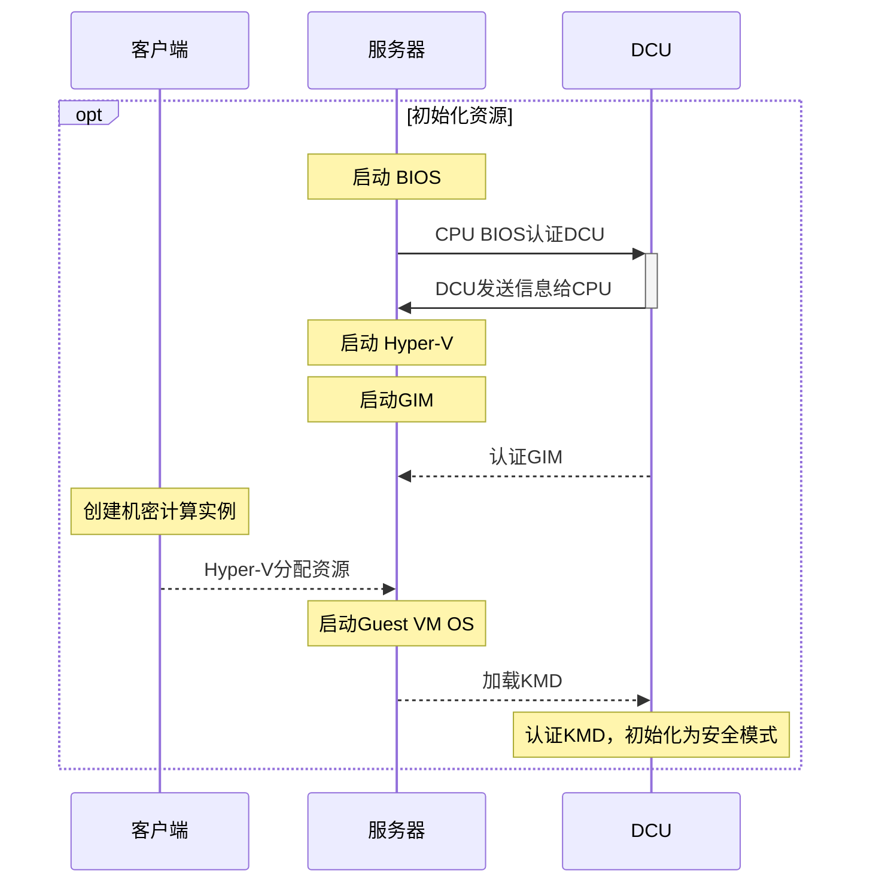

>欢迎体验 [Fluid](https://github.com/fluid-dev/hexo-theme-fluid) ，这是一款 Material Design 风格的 Hexo 主题，以简约的设计帮助你专注于写作，本篇文章可预览主题的样式及功能。
>https://github.com/fluid-dev/hexo-fluid-blog/blob/master/source/_posts/hello-fluid.md

<!-- more -->

## 文字

文章大部分使用的是 github-markdown 样式，并加入了一些 Material 风格。

### H3 标题

#### H4 标题

**粗体**

_斜体_

## 代码

行内代码：`$ hexo new post "My New Post"`

代码高亮使用的是 highlight.js，支持 185 种语言和 91 种高亮样式：

```python
def fib(n):
    a, b = 0, 1
    while a < n:
        print(a, end=' ')
        a, b = b, a+b
    print()
fib(1000)
```

```go
type Map struct {
    mu Mutex
    read atomic.Value
    dirty map[interface{}]*entry
    misses int
}
```

## 表格

| Left | Center | Right |
|:---|:---:|---:|
| Key 1 | Value 1 | Comment 1 |
| Key 2 | Value 2 | Comment 2 |
| Key 3 | Value 3 | Comment 3 |

## 列表

### 有序列表

Fluid 相较于其他主题的优势：

1. 设计遵循简洁至上，同时具有轻快的体验，和优雅的颜值；
2. 提供大量定制化配置项，使每个用户使用该主题都能具有独特的样式；
3. 响应式页面，适配手机、平板等设备；

### 无序列表

Fluid 功能特性：

- 无比详实的[用户文档](https://hexo.fluid-dev.com/docs/)
- 页面组件懒加载
- 多种代码高亮方案
- 多语言配置
- 内置多款评论插件
- 内置网页访问统计
- 内置文章本地搜索
- 支持暗色模式
- 支持脚注语法
- 支持 LaTeX 数学公式
- 支持 mermaid 流程图

## 图片


## 流程图

基于 mermaid 语法：



## 内置 Tag 插件

内置了一些 Tag 插件，用于实现 Markdown 不容易生成的样式，具体使用方式请见 [用户指南](https://hexo.fluid-dev.com/docs/guide/#tag-%E6%8F%92%E4%BB%B6)。

### 便签


这里可以写文字 或者 `markdown`



这里可以写文字 或者 `markdown`



这里可以写文字 或者 `markdown`


### 行内标签

  

### 勾选框




### 按钮



### 折叠块


折叠内容，可以写文字 或者 `markdown`



```python
def fib(n):
    a, b = 0, 1
    while a < n:
        print(a, end=' ')
        a, b = b, a+b
    print()
fib(1000)
```


### 组图


  
  
  
  
  


### 脚注

以下是脚注演示[^1]：

如果你有 Fluid 主题或 Hexo 博客相关的文章，可以通过 Pull Request 方式投稿[^2]。

[^1]: 脚注演示
[^2]: 投稿具体详见[https://github.com/fluid-dev/hexo-fluid-blog](https://github.com/fluid-dev/hexo-fluid-blog)